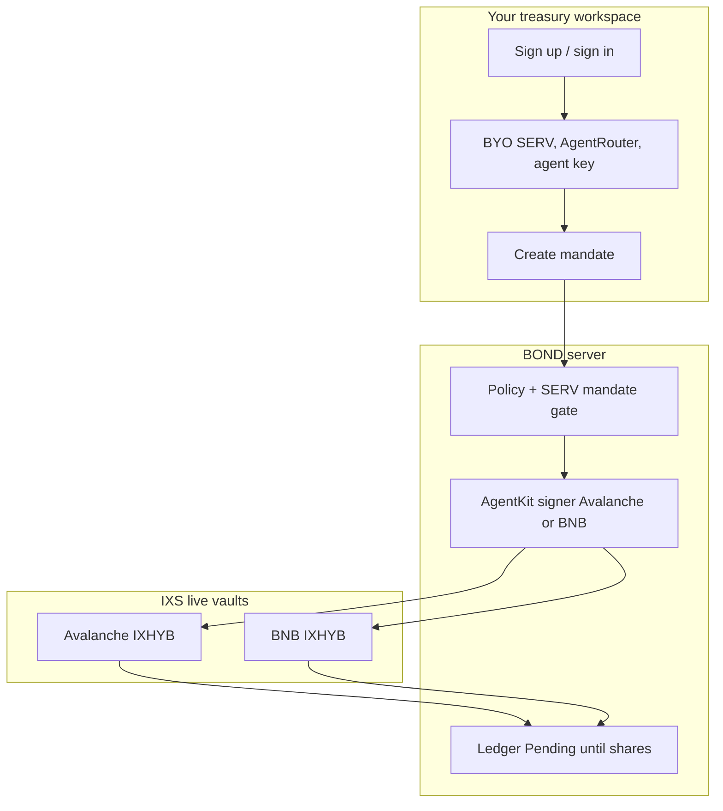
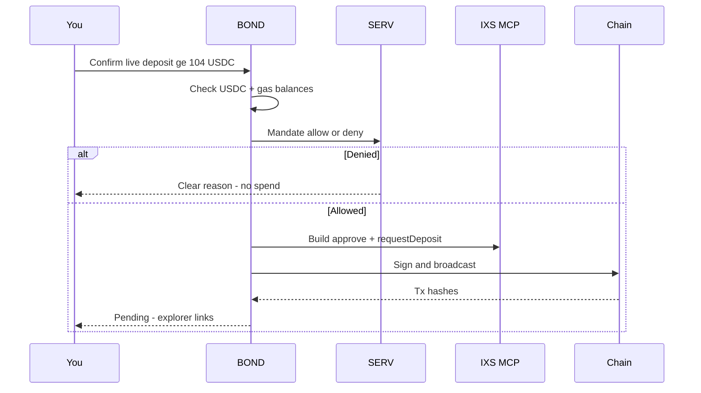
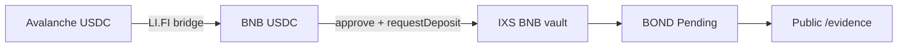
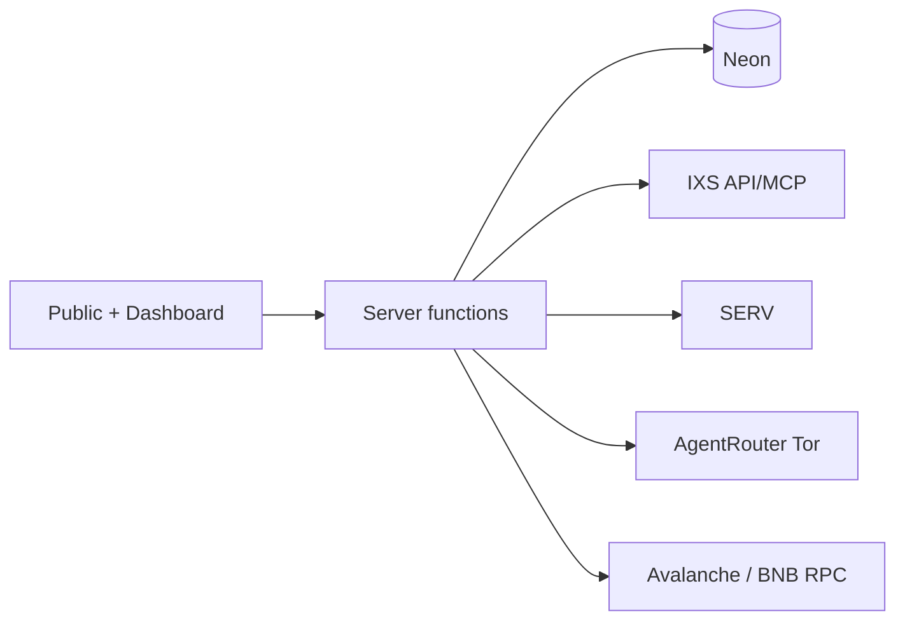

# BOND

<p align="center">
  
</p>

<p align="center">
  
</p>

<p align="center">
  <strong>Mandate in. Deposit on IXS. Stay Pending until shares are real.</strong>
</p>

<p align="center">
  <a href="https://github.com/henrysammarfo/bond"></a>
  <a href="https://www.openserv.ai/hackathon"></a>
</p>

<p align="center">
  
  
  
  
  
</p>

---

## Project description and overview

**BOND** is an honest treasury desk for real-world asset vaults on IXS.

Imagine a school club treasurer. They may only spend up to a monthly limit. They send money to a real savings product. The bank takes a day to process it. Until the bank confirms, the club does **not** write “we already earned interest” in the notebook.

**BOND is that notebook — for on-chain RWA vaults.**

You open a workspace. You get your own AgentKit address (or import one). You can plug in your own SERV / AgentRouter keys — or use the demo keys. You create a mandate (“up to $X USDC on Avalanche or BNB”). You subscribe to a live IXS vault (≥ $104). The screen says **Pending — not earning** until IXS shares show up.

> Soft pitch we use everywhere: BOND lets a treasury allow a subscription, send real USDC into IXS RWA vaults on Avalanche or BNB Chain, and refuse to pretend the bond is “owned” before the vault finishes.

We never invent fills. We never invent shares. Missing APIs fail closed. We will not say unhackable.

---

## Two live vault lanes (IXS)

| Lane | Chain | Role | Vault id |
| :--- | :--- | :--- | :--- |
| **Primary** | Avalanche C-Chain | Permissionless subscribe | `6a952729732c2b84b55ce89d` |
| **Companion** | BNB Chain | Permissionless subscribe | `6a26624ca7d16b245d665475` |
| Whitelist listings | Avalanche / BNB | Browse + compare only | Live from IXS API |

Same AgentKit address works on both EVM chains. Fund **USDC + gas on the chain you use**.



---

## How a deposit flows



---

## Live Path A proof (BNB)

104 USDC subscribed on the BNB permissionless vault. Status in-app: **Pending**.

| Step | Explorer |
| :--- | :--- |
| Approve | https://bscscan.com/tx/0x7680eaa08f91c39ffffc46d2bc990e3a7cc7a3cd7cae3bf761c24bfd84b8a29b |
| requestDeposit | https://bscscan.com/tx/0x227cb6a981c773f0e9a4ddb0942b4662f07c2a1453e678bbe2974e2c18d70f0c |

Full bridge + deposit sheet: [`docs/memory/LIVE_PROOF.md`](docs/memory/LIVE_PROOF.md)



---

## Preflight · SERV · Evidence

Before any live AgentKit deposit, BOND runs deterministic checks on the real IXS vaults:

| Check | Fail → |
| :--- | :--- |
| Vault status / paused | REJECT |
| Whitelist (KYC vaults) | REJECT |
| NAV age / `maxDeposit` = 0 | DEFER |
| IXS MCP deposit build | REJECT when otherwise open |
| Live redeemable floor **$104** | REJECT (100 USDC can trap under redeem min after 0.5% fee) |
| ≤ **25%** of vault TVL | Cap / DEFER for capacity |

SERV returns **ALLOCATE / DEFER / REJECT** with reasons. Results publish to [`/evidence`](./src/routes/evidence.tsx) (public call log). Dashboard → **Scan** runs the analysis; **eth_call** simulates without broadcasting.

## What we built that is unusual

| Piece | Why it matters |
| :--- | :--- |
| Per-org AgentKit vault | Every workspace gets its own address (encrypted). Judges can BYO keys. |
| Dual-chain IXS | Avalanche **and** BNB permissionless vaults — full catalog from the live API |
| Tor + stainless AgentRouter | Cloud IPs hit WAF captchas; Tor SOCKS returns real JSON |
| Funding preflight | Insufficient USDC/gas fails **before** signing, with the fund address |
| Pending honesty | Owned $ stays zero until live share proof |
| Preflight + evidence | NAV / whitelist / TVL / redeem-floor before sign; public `/evidence` |

Deep technical ledger (bugs, workarounds, safety): [`docs/memory/TECHNICAL_DEEP_DIVE.md`](docs/memory/TECHNICAL_DEEP_DIVE.md)

---

## Flaws we hit · and how we lived with them

| Flaw | What broke | What we did |
| :--- | :--- | :--- |
| AgentRouter Aliyun WAF on cloud IPs | Looked like a bad key | Tor SOCKS + stainless headers + `smoke:llm` |
| Bun dropped `DATABASE_URL` with `&` | Neon push failed silently | Quote the URL · dotenv override |
| CDP API JSON ≠ Wallet Secret ≠ Export scope | `403 accounts#export` | Import key · sign with viem |
| SERV returned `approved` not `allow` | Mandate gate threw | Accept both keys · fix prompt |
| Shared platform signer for every org | Confusing “my wallet” | Per-org encrypted AgentKit address |
| AgentKit package vs Cloudflare | Bundle broke Workers | viem-only signer path |

---

## Technology stack

| Layer | Tools | Role on BOND |
| :--- | :--- | :--- |
| App | TanStack Start, React 19, Tailwind, TypeScript | Public site + live dashboard |
| Auth / tenancy | Neon Postgres, Drizzle, httpOnly sessions | Multitenant orgs without stuffing secrets into localStorage |
| Vaults | IXS REST + MCP | Avalanche + BNB live catalog, deposit, claim |
| Signing | viem AgentKit key (CDP-aligned) | Same address, two chains |
| Reasoning | OpenServ SERV → AgentRouter failover | Mandate allow/deny before spend |
| Host | Vercel (default) / Cloudflare Workers | Secrets only in server env |



---

## Repository map

```
bond/
├── src/                  # Marketing + dashboard + backend
├── docs/
│   ├── brand/            # Logotype + orbit symbol (README / form Q6)
│   └── memory/           # Bible, proof, submit kit, operator docs
├── artifacts/demo/       # Live videos, stills, social upload assets
├── public/               # favicon, og.png, robots, sitemap
└── scripts/              # db:push, Tor smoke, CDP export, bridge
```

---

## Getting started

```bash
git clone https://github.com/henrysammarfo/bond.git
cd bond
bun install
cp .env.example .env.local   # fill secrets — never commit
bun run db:push
bun run tor:start            # if AgentRouter from cloud IP
bun run dev
```

### Useful scripts

```bash
bun test
bun run smoke:llm
bun run smoke:stack          # tests + Tor smoke + build
bun run cdp:export
```

---

## Docs for humans and judges

| Doc | Purpose |
| :--- | :--- |
| [`docs/memory/BOND_BIBLE.md`](docs/memory/BOND_BIBLE.md) | Product doctrine |
| [`docs/memory/LIVE_PROOF.md`](docs/memory/LIVE_PROOF.md) | On-chain Path A hashes |
| [`docs/memory/SUBMIT_KIT.md`](docs/memory/SUBMIT_KIT.md) | Form + X copy |
| [`docs/memory/TECHNICAL_DEEP_DIVE.md`](docs/memory/TECHNICAL_DEEP_DIVE.md) | Bugs, APIs, novelty |
| [`docs/memory/OPERATOR_SETUP.md`](docs/memory/OPERATOR_SETUP.md) | How to run and fund |
| [`docs/memory/SECURITY.md`](docs/memory/SECURITY.md) | Keys, redeem, access |
| [`docs/memory/VAULT_LIVE.md`](docs/memory/VAULT_LIVE.md) | Live IXS vault ids |
| [`docs/memory/WIN_CHECKLIST.md`](docs/memory/WIN_CHECKLIST.md) | Submit evidence |
| [`docs/brand/`](docs/brand/) | Logo assets for README + OpenServ Q6 |

---

## Brand / logo assets (OpenServ Q6)

| File | Use |
| :--- | :--- |
| [`docs/brand/bond-symbol-orbit-1080.png`](docs/brand/bond-symbol-orbit-1080.png) | Square symbol (cream on forest) |
| [`docs/brand/bond-logotype-orbit-wordmark.png`](docs/brand/bond-logotype-orbit-wordmark.png) | Wordmark |
| [`docs/brand/bond-logotype-social.png`](docs/brand/bond-logotype-social.png) | 1024×1024 social upload |
| [`docs/brand/bond-logotype.svg`](docs/brand/bond-logotype.svg) | Vector wordmark |
| [`docs/brand/bond-symbol-seal-1080.png`](docs/brand/bond-symbol-seal-1080.png) | Seal variant |

---

## Launch checklist (website)

Privacy · Terms · no frontend secrets · HTTPS headers · cookie consent · meta + social preview · favicon · sitemap/robots · image alt · compression · contrast · mobile · custom 404 · forms + honeypot · optional Plausible analytics · single clear CTA (**Open treasury**).

---

## Honest limits

- Async ERC-7540: Pending can last hours–days.  
- Whitelist IXS vaults are browse-only until approved.  
- Serverless hosts need a Tor/relay path for AgentRouter.  
- We will not say unhackable.

Built to be tried. Built to be checked on-chain. Built so Pending stays Pending.
