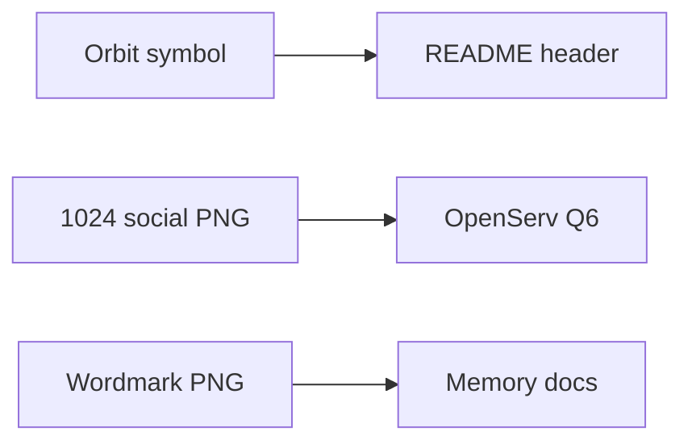

# BOND brand assets

Cream-on-forest marks for README, OpenServ form Q6, and social upload.

| File | Size | Use |
| --- | --- | --- |
| [bond-symbol-orbit-1080.png](bond-symbol-orbit-1080.png) | 1080×1080 | Primary symbol |
| [bond-symbol-seal-1080.png](bond-symbol-seal-1080.png) | 1080×1080 | Seal variant |
| [bond-logotype-orbit-wordmark.png](bond-logotype-orbit-wordmark.png) | wordmark | README header |
| [bond-logotype-social.png](bond-logotype-social.png) | 1024×1024 | Form / X upload |
| [bond-logotype.svg](bond-logotype.svg) | vector | Editable wordmark |

Same files also live under `artifacts/demo/` next to the demo videos.
