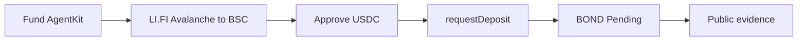
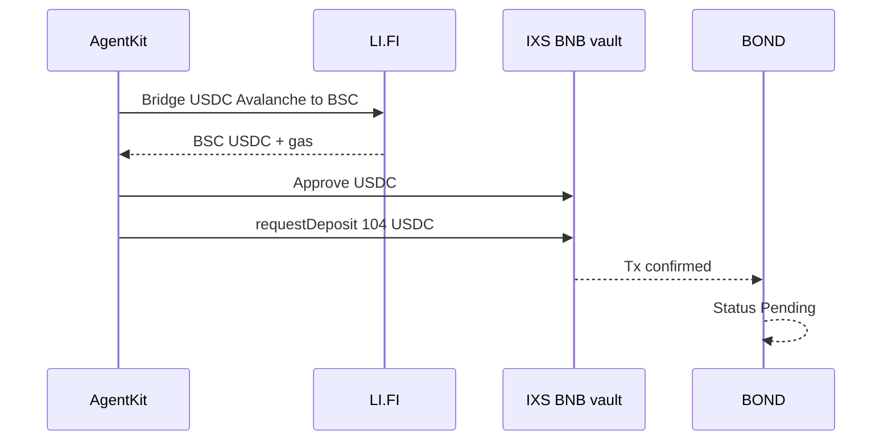

# Live Path A proof — OpenServ Edition 01

  

Verified on-chain. Refresh the explorer links anytime.

## AgentKit signer

`0x1eFBb041E94aCc18D50C578eD34c265075d3b14e`

Same EVM address on Avalanche and BNB Chain.

## Flow

## Bridge Avalanche USDC → BNB Chain (LI.FI)

Moved live USDC from Avalanche onto BSC so the BNB IXS lane could clear the 104 USDC floor.

| Step | Tx | Explorer |
| --- | --- | --- |
| Approve USDC for gas bridge | `0xbfc26eb1903fec4538f09f891a90184e1bddb71a10dccbe48b3e1aca61e75491` | https://snowscan.xyz/tx/0xbfc26eb1903fec4538f09f891a90184e1bddb71a10dccbe48b3e1aca61e75491 |
| Bridge dust USDC → native BNB | `0x57a1753b1196b67194ec3adbb1f720d7629d472c3de9611c690fbee9d1f3b84b` | https://snowscan.xyz/tx/0x57a1753b1196b67194ec3adbb1f720d7629d472c3de9611c690fbee9d1f3b84b |
| Approve USDC for main bridge | `0x1d206d28b78fd427b1944a3a2761a135aa881f678dd2a04f57222a76b00de306` | https://snowscan.xyz/tx/0x1d206d28b78fd427b1944a3a2761a135aa881f678dd2a04f57222a76b00de306 |
| Bridge 104.5 USDC Avalanche → BSC USDC | `0xf7ad84d5d4a30efc93f81d200d58b2b11de9c3046bed532e58f828057b1322be` | https://snowscan.xyz/tx/0xf7ad84d5d4a30efc93f81d200d58b2b11de9c3046bed532e58f828057b1322be |

Result on BSC after bridge: about **104.207 USDC** + **0.00057 BNB** gas.

## Live IXS subscribe (BNB permissionless vault)

Vault ID: `6a26624ca7d16b245d665475`  
Amount: **104 USDC**  
Status in BOND: **Pending** (not earning, not owned)  
Subscription: `a974083b-a637-41e1-9159-45491cf1ec08`  
App: https://bond-pi.vercel.app/dashboard/subscriptions/a974083b-a637-41e1-9159-45491cf1ec08

| Step | Tx | Explorer |
| --- | --- | --- |
| Approve USDC for vault | `0x7680eaa08f91c39ffffc46d2bc990e3a7cc7a3cd7cae3bf761c24bfd84b8a29b` | https://bscscan.com/tx/0x7680eaa08f91c39ffffc46d2bc990e3a7cc7a3cd7cae3bf761c24bfd84b8a29b |
| requestDeposit / subscribe | `0x227cb6a981c773f0e9a4ddb0942b4662f07c2a1453e678bbe2974e2c18d70f0c` | https://bscscan.com/tx/0x227cb6a981c773f0e9a4ddb0942b4662f07c2a1453e678bbe2974e2c18d70f0c |

SERV: allow (source `serv`)  
Preflight: **allocate**

## Public evidence

https://bond-pi.vercel.app/evidence

## Demo media

| Asset | Path |
| --- | --- |
| Synced live VO cut | [`artifacts/demo/bond-live-path-a-synced-x.mp4`](../../artifacts/demo/bond-live-path-a-synced-x.mp4) |
| Stills (home → Pending → BscScan) | [`artifacts/demo/`](../../artifacts/demo/) |
| Brand / Q6 logos | [`docs/brand/`](../brand/) |

## Why Avalanche primary was REJECT earlier

Live TVL on the Avalanche vault was too thin for a 104 USDC leg under the ≤25% concentration rule, and on-chain maxDeposit was 0 (NAV stale). BOND fail-closed. We bridged to the BNB companion lane that cleared preflight and completed the live subscribe above.
