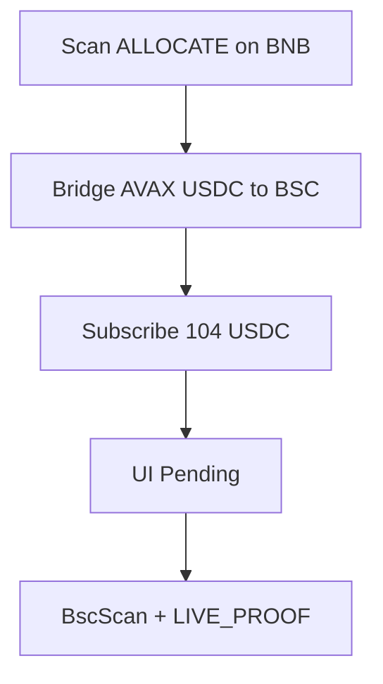

# Win checklist — RWA Vaults

  

- [ ] OpenServ org data collection enabled
- [x] SERV Reasoning used in mandate gate
- [x] AgentKit Avalanche wallet funded (≥104 USDC + AVAX gas) — bridged to BNB for live Path A
- [x] Live deposit tx hash(es) recorded — BNB vault after Avalanche→BSC bridge. See `LIVE_PROOF.md`
- [x] UI shows **Pending** (not earning) after requestDeposit
- [ ] Shares shown only after live position proof
- [x] Public demo URL live — https://bond-pi.vercel.app
- [ ] X post + @openservai + form submitted before 28 Sep 2026 00:00 UTC — copy in `SUBMIT_KIT.md`
- [x] Demo V2 ledger video — `artifacts/demo/bond-openserv-v2-x.mp4`
- [x] Full live demo + synced Liam VO Hyperframes cut — `artifacts/demo/bond-live-path-a-synced-x.mp4`
- [x] Vault detail route bug fixed (Outlet layouts) — deployed
- [x] Demo password rotated after record
- [x] README logo + mermaid diagrams render on GitHub
- [x] Brand assets in `docs/brand/` for form Q6
- [x] No invented TVL / balances in screenshots

## Live evidence

| Field | Value |
| --- | --- |
| Wallet | `0x1eFBb041E94aCc18D50C578eD34c265075d3b14e` |
| Vault ID (BNB) | `6a26624ca7d16b245d665475` |
| Approve tx | https://bscscan.com/tx/0x7680eaa08f91c39ffffc46d2bc990e3a7cc7a3cd7cae3bf761c24bfd84b8a29b |
| RequestDeposit tx | https://bscscan.com/tx/0x227cb6a981c773f0e9a4ddb0942b4662f07c2a1453e678bbe2974e2c18d70f0c |
| Subscription | https://bond-pi.vercel.app/dashboard/subscriptions/a974083b-a637-41e1-9159-45491cf1ec08 |
| Bridge proof | [`LIVE_PROOF.md`](LIVE_PROOF.md) |
| Demo URL | https://bond-pi.vercel.app |
| Logos | [`docs/brand/`](../brand/) |
| X post URL | |

